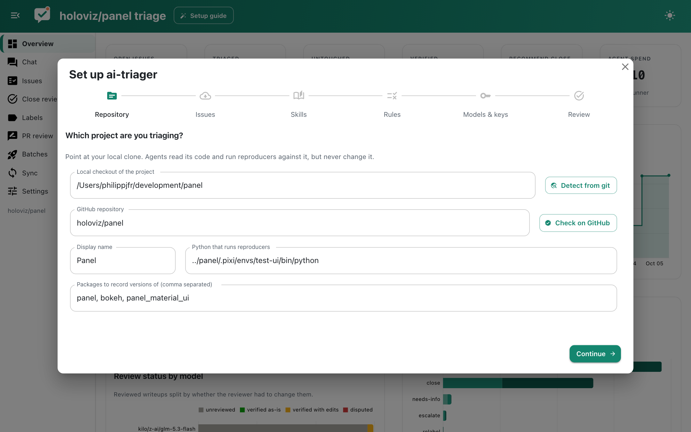

# Getting started

## Install

ai-triager needs Python 3.11 or newer and the [GitHub CLI](https://cli.github.com/) (`gh`), logged in with `gh auth login`. The command line tool itself has no dependencies; extras add the agent runner, the app and decision models.

```bash
pip install -e '.[agent,app,decisions]'
```

| Extra | Adds |
|---|---|
| `agent` | pydantic-ai, for the built-in agent runner |
| `app` | Panel, panel-material-ui, panel-splitjs and pydantic-ai, for the web app |
| `decisions` | typesafe-sdk, for the Jev decision model |

If you already have an environment with Panel and panel-material-ui (for example a development env), layer a venv on top of it so those packages are shared:

```bash
python -m venv --system-site-packages .venv
.venv/bin/pip install -e '.[agent,decisions]'
```

## Create a workspace

A workspace is a directory that holds the writeups, reproducers and configuration for one repository. Point `ai-triager init` at a directory and, ideally, at a local clone of the project:

```bash
ai-triager init ~/development/param-triage --checkout ~/development/param
cd ~/development/param-triage
```

The GitHub repository is inferred from the checkout's git remote; pass `--repo owner/name` to set it explicitly. Other useful options are `--python` (the interpreter that runs reproducers, usually the project's development environment) and `--skills` (directories with agent skills).

`init` writes a `triage.py` entry point into the workspace that always runs with the interpreter ai-triager was installed into, so `./triage.py <command>` works from any shell.

## Finish setup in the app

```bash
./triage.py app --show
```

When the configuration is incomplete the app opens a setup guide. It walks through the repository and checkout, the reproducer environment, skills, rules, API keys and the models used for each task. Everything it writes ends up in `triage.toml` (comments are preserved), and API keys are stored outside the workspace in `~/.config/ai-triager/credentials.json`. You can reopen it at any time from the header.



The same steps work from the command line:

```bash
./triage.py keys --set OPENROUTER_API_KEY   # prompts for the key
./triage.py check                           # shows what is configured and what is missing
./triage.py sync                            # fetches the open issue list
./triage.py doctor                          # checks gh, the project env and the browser pipeline
./triage.py sandbox                         # probes the sandbox and the guard
```

## Triage your first batch

```bash
./triage.py launch -m openrouter:openai/gpt-6-luna -c 5
./triage.py jobs
```

This claims five issues and runs one agent session per issue in the background. Follow along on the Batches page of the app, then read the results on the Issues page or directly in `issues/<N>.md`.
