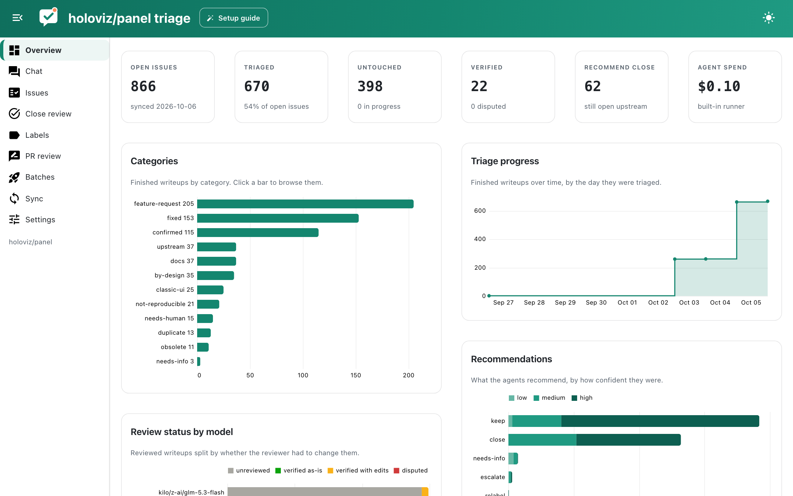

# ai-triager

ai-triager helps open-source maintainers work through a backlog of GitHub issues and pull requests. LLM agents claim issues, try to reproduce them against your local checkout, and write down what they found in a plain markdown file per issue. You (or a stronger model) review those writeups, and when you agree with a recommendation the app can close the issue, fix its labels or post a comment for you.

## What it does

**Issue triage.** Each open issue gets a writeup in `issues/<N>.md` with a category (`fixed`, `duplicate`, `confirmed`, `feature-request` and so on), a confidence, a recommendation, the reproducer that was run and a draft reply. Writeups are ordinary files: read them in your editor, edit them by hand, commit them if you like.

**Review and closing.** A review pass reruns reproducers and checks the reasoning. The close review page lists issues recommended for closing with their confidence and reviewers, so you can accept the proposed comment, send an issue back for re-review, or keep it open, then close the accepted ones in one batch.

**Labels and issue types.** A decision model such as [Jev](models.md#decision-models) estimates how likely each label in your catalogue applies to an issue, including GitHub issue types, and suggests what to add or remove.

**Pull requests.** A first pass over open PRs checks them against your PR template and contribution (AI) policy and asks whether the changes pass a smell test, so you can spend review time on the PRs that are ready.

**Chat.** Ask questions about the backlog in plain language; tables of issues, writeups and stats are available to the chat agent as DuckDB tables.

## Safety first

Issue text is written by strangers and agents read it, so prompt injection is the main risk. Every shell command an agent runs is screened by a decision model first and then executed in a sandbox without network access, credentials or write access outside the workspace outputs. Agents never write to GitHub; only you do, through confirm dialogs in the app or explicit CLI flags. See [Sandbox and guard](security.md).

## Where to go next

- [Getting started](getting-started.md) installs ai-triager and sets up a workspace.
- [Workspaces](workspaces.md) explains the files and how to encode project knowledge as rules.
- [Running agents](running-agents.md) covers triage and review batches.
- [The app](app.md) tours every page.
