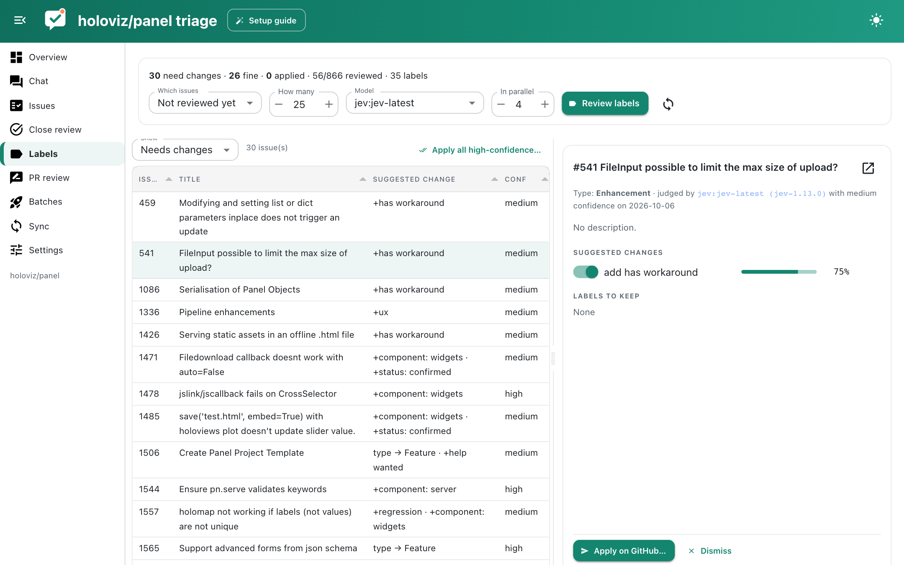

# Label review

Label review checks whether each issue's labels and GitHub issue type are right, and suggests changes.



## How it works

`./triage.py labels sync` fetches the repository's label catalogue (names and descriptions) and its issue types. Good label descriptions matter: they are what the model reads to decide whether a label applies.

For each issue, a decision model gets the issue's title, body, current labels and type, plus the catalogue, and answers one question per label ("does this label apply?") and one choice question for the issue type. Labels above `add_threshold` that the issue lacks are suggested for adding; current labels below `remove_threshold` are suggested for removal. If the decision model is replaced by an LLM, it returns a structured verdict with a reason per label instead of probabilities.

```toml
[labels]
add_threshold = 0.75
remove_threshold = 0.25
exclude = ["dependencies", "python", "javascript"]   # e.g. labels only bots apply
```

## Reviewing suggestions

On the Labels page choose which issues to review (not reviewed yet, without labels, triaged, or all open issues), how many and how many in parallel, then **Review labels**. Results appear as they come in. For each issue the detail pane shows the suggested changes with their probabilities, each with a switch, and the labels that fit. **Apply on GitHub…** shows exactly what will change and asks for confirmation; **Apply all high-confidence…** does the same for every high-confidence suggestion.

From the command line:

```bash
./triage.py labels sync
./triage.py labels classify --scope unreviewed --count 50 --model jev:jev-latest
./triage.py labels list
./triage.py labels apply --issue 1234          # dry run
./triage.py labels apply --issue 1234 --yes
```
