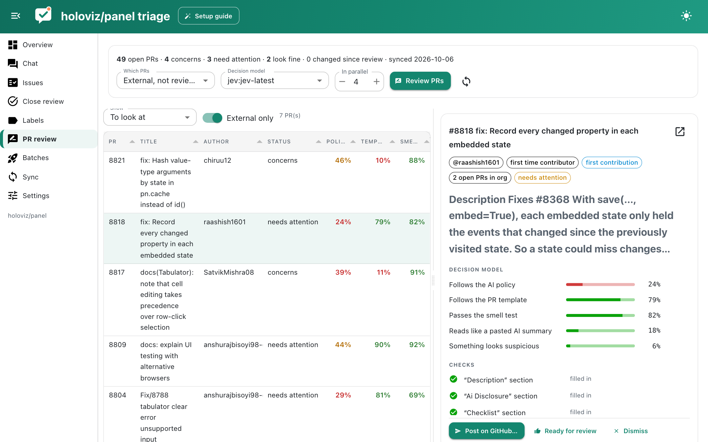

# PR review

PR review is a first pass over open pull requests that answers three questions before a maintainer spends time on a PR: does the description conform to our AI policy, does it follow the PR template, and do the changes pass a smell test.



## What is checked

**Automatic checks** compare the description with the PR template and the policy:

- every template section is present and filled in, not left as the placeholder; sections the template says may be deleted (such as an AI disclosure when no AI was used) can be removed;
- placeholders such as `{issue}` were replaced and the checklist is ticked;
- the AI disclosure, if kept, names the tool and model;
- an issue is linked with "Fixes #N";
- screenshots or a recording are included when frontend files changed;
- code changes come with test changes;
- the author has at most `max_open` open PRs across the organisation;
- the description is not mostly a bullet list of changes.

**Decision model questions**, each answered with a probability, given the description, the template, the policy, the automatic checks and an excerpt of the diff:

| Question | Good when |
|---|---|
| Follows the AI policy | high |
| Follows the PR template | high |
| Passes the smell test: focused, consistent with the issue, idiomatic, tested | high |
| Reads like a pasted AI summary | low |
| Something looks suspicious: obfuscated code, network calls, unrelated CI or packaging changes | low |

Each PR ends up as **looks fine**, **needs attention** (one failed check or score) or **concerns** (several, or anything suspicious). Bots such as Dependabot and pre-commit.ci are skipped, and by default so are maintainers (`trusted` author associations), though you can include them.

## Policy and template

The policy is a markdown file in the workspace, `prs/policy.md` by default; put your project's contribution or AI usage rules there. The template is found automatically in the repository's `.github` folder or the organisation's `.github` repository, or you can point `template` at a file.

```toml
[prs]
policy = "prs/policy.md"
template = ""                 # empty: the repository's or organisation's pull_request_template.md
max_open = 2
threshold = 0.5
trusted = ["OWNER", "MEMBER", "COLLABORATOR"]
model = ""                    # default: [agents] decision_model
explain_model = "openrouter:openai/gpt-6-luna"
```

## Acting on results

For each PR the detail pane shows the scores, every check with its outcome, the changed files and a comment box. **Draft comment** asks an LLM (`explain_model`) to write a short, friendly comment that lists only what is missing; edit it, then **Post on GitHub…** posts it after a confirmation. **Ready for review** and **Dismiss** record your decision locally. When new commits are pushed the PR shows as changed since review and is picked up again by the next "not reviewed" run.

```bash
./triage.py prs sync
./triage.py prs review --scope external --limit 20
./triage.py prs review 8821
./triage.py prs list
./triage.py prs comment 8821      # draft a comment; posting is done in the app
```

PR descriptions and diffs are untrusted input too. They only reach models as data to judge, and the models used here have no tools.
